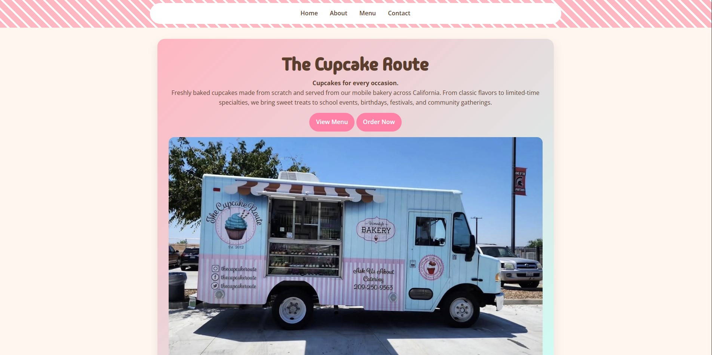
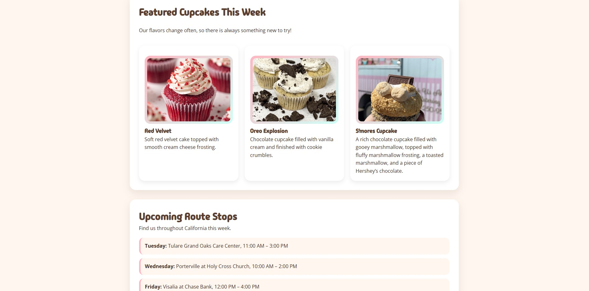
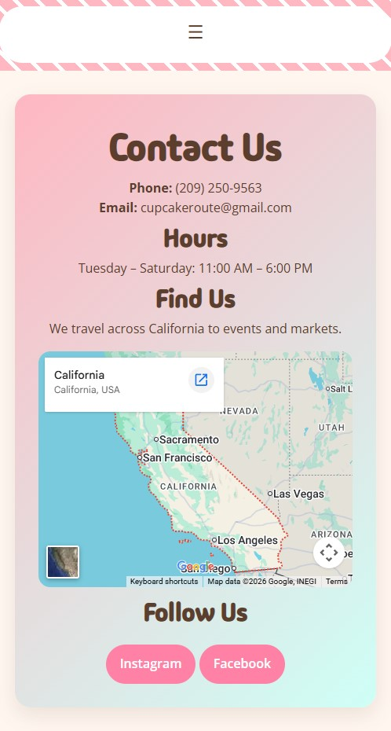

# The-Cupcake-Route-Website 

## Description
The Cupcake Route is a fully functional bakery website created for my final project. This website was designed for a mobile cupcake truck business that travels across California serving a daily rotation of fresh cupcakes with unique toppings and flavors.

## Student name
Nayeli Ambrosio

## Project overview
The goal of this project is to create a professional looking website where users can learn about the business, view cupcake flavors, find route locations, and contact the company. The website is compatible with mobile devices, desktop, and tablets.

## Live website
https://nayamb.github.io/The-Cupcake-Route/

## Technologies used
Html CSS Javascript Google Fonts

## Website features
- Featured cupcake section with images
- Contact page and embedded Google Map
- Social media links
- Responsive design for desktop, mobile, and tablet
- Mobile hamburger navigation menu
- Accessibility improvements

## CSS features
- Custom color palette
- Google fonts added (Madimi One and Open Sans)
- Styled buttons, gradients, and hover effects
- Responsive layouts
- Card styled sections with image styling

## Javascript features
- Mobile hamburger navigation menu
- Toggle function for opening and closing navigation
- Icon changes when menu is open or closed

## Screenshots

### Homepage

### Featured cupcakes section

### Contact section

## Date
May 2026